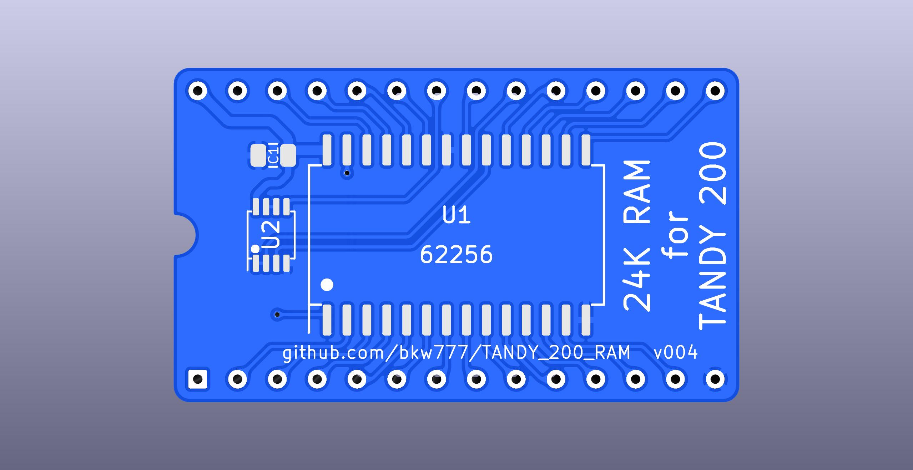
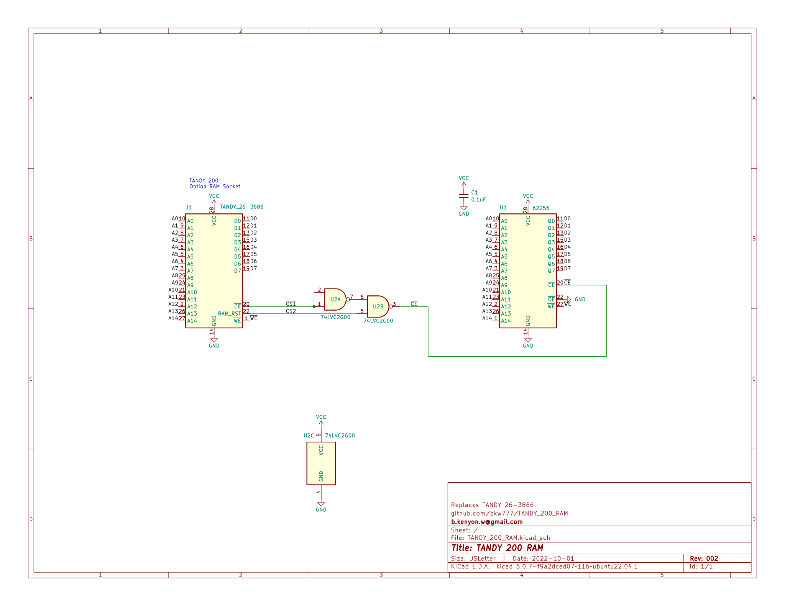
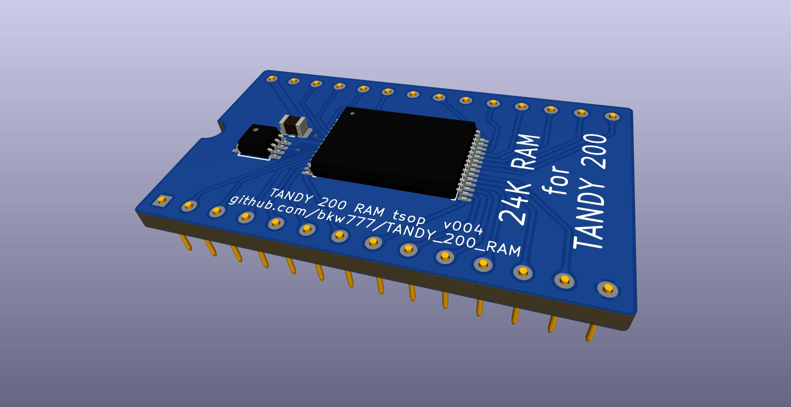
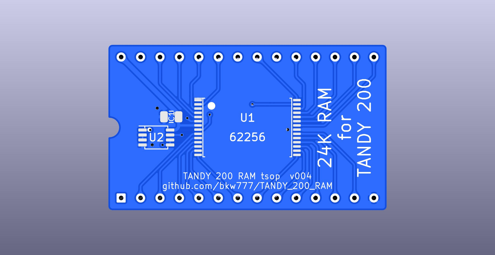
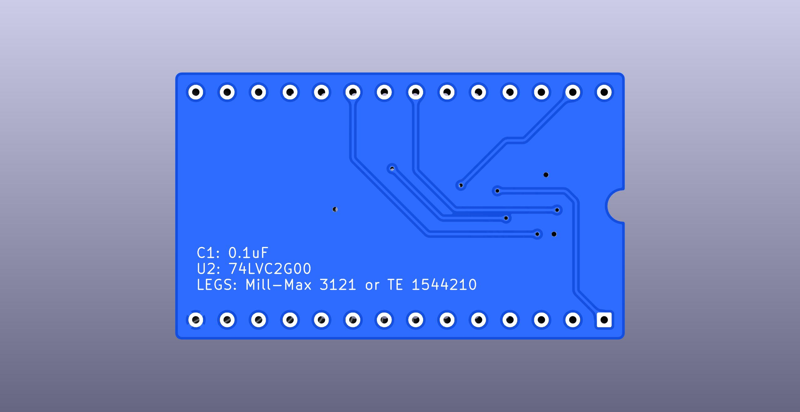
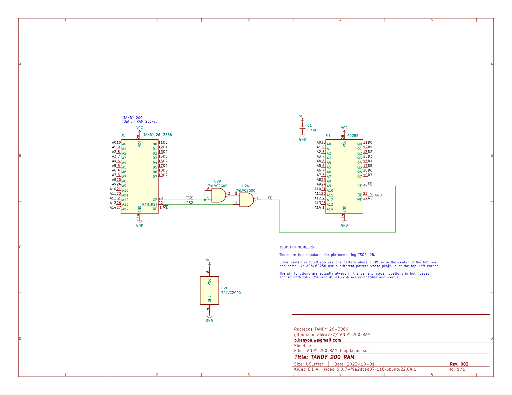
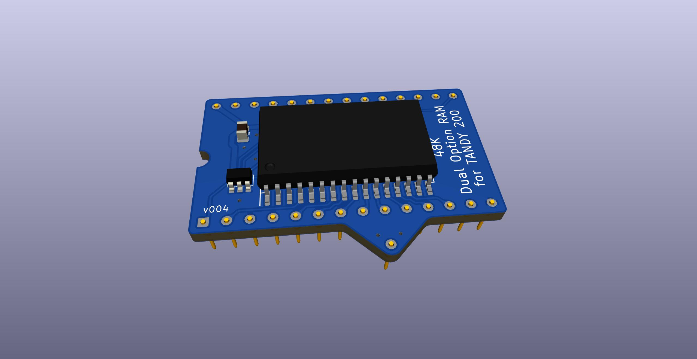
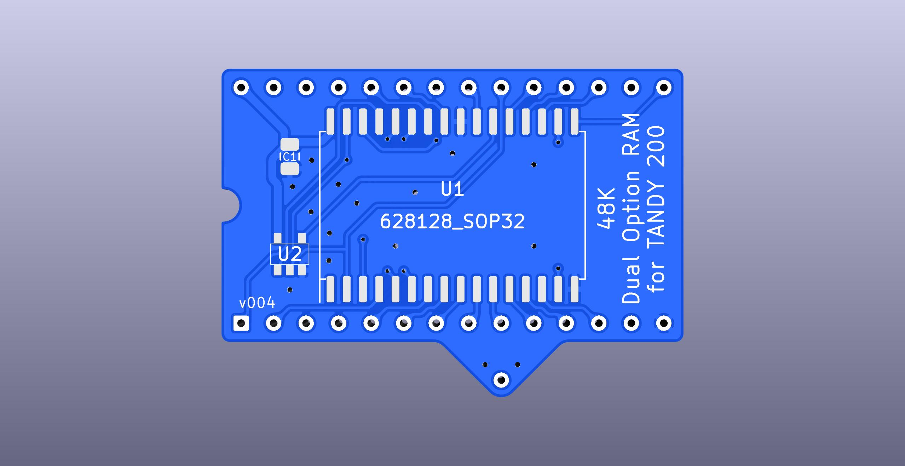
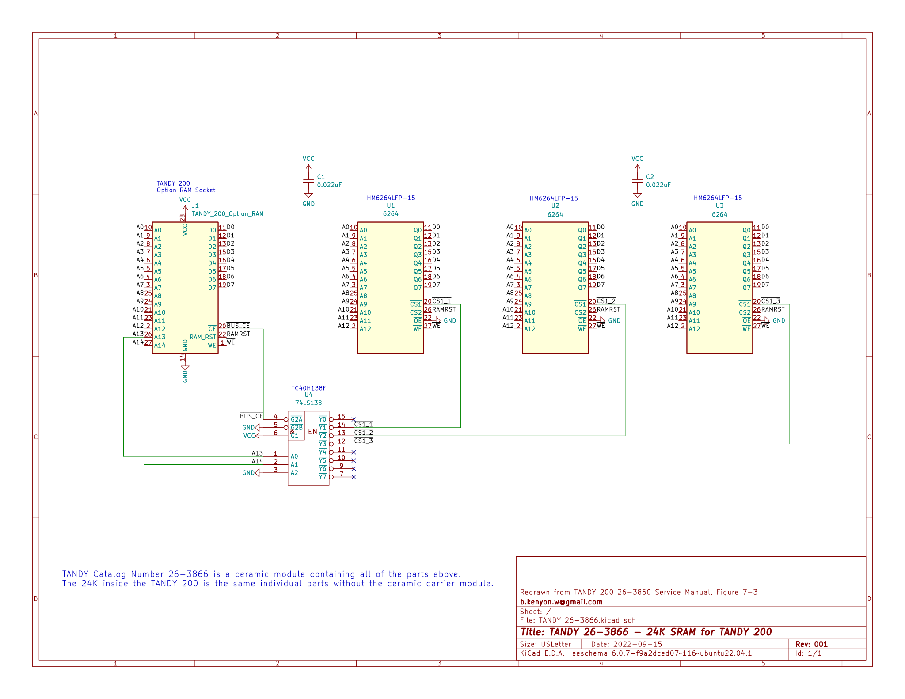

# Option RAM module for TANDY 200

Replacements for TANDY 26-3866 24K SRAM module for TANDY 200 portable computer.

<!--
There are a few different designs available that all do the same thing but using different parts.

Some variants are single-bank like the original TANDY 26-3866 ceramic 24k module. These are drop-in replacements for the original modules, where one board = one bank = one Option RAM socket. You can have up to two boards installed in the machine.

Some variants are dual-bank, where one board supplies both Option RAM bank #1 and #2. You plug the one board into the Option RAM #2 socket, and this takes the place of two single-bank modules.

Some variants use different chip packages, so that you have options to use whatever types of chip you have, or can get, or can solder by hand.

There is also a [schematic of the original RAM bank](TANDY_26-3866.svg), re-drawn in KiCAD just for reference. There is no PCB for this, it's just for reference while designing new replacement modules to help ensure the replacement really still outwardly works the same as the original.
-->

See the releases tab for gerber zips for manufacturing.

## Single-Bank

  
  
  
  

<!-- PCB from [OSHPark](),  or  [PCBWAY](),  or  [gerbers](../../releases/latest/)  -->
BOM from [DigiKey](https://www.digikey.com/short/f5hhwt4j),  or  [TANDY_200_RAM.BOM.csv](TANDY_200_RAM.BOM.csv)  

<!--
## Single-Bank SMT TSOP

  
  
  
  

PCB from [OSHPark](),  or  [PCBWAY](),  or  [gerbers](../../releases/latest)  
BOM from [DigiKey](),  or  [BOM.csv]()  

## Single-Bank THT DIP

  
  
  
  

PCB from [OSHPark](),  or  [PCBWAY](),  or  [gerbers](../../releases/latest)  
BOM from [DigiKey](),  or  [BOM.csv]()  
-->

## Dual-Bank

  
  
  
  

<!-- PCB from [OSHPark](),  or  [PCBWAY](),  or  [gerbers](../../releases/latest/)  -->  
BOM from [DigiKey](https://www.digikey.com/short/25v45c90),  or  [TANDY_200_Dual_RAM.BOM.csv](TANDY_200_Dual_RAM.BOM.csv)  

## Dual-Bank - TSOP

  
  
  
  
  

<!-- PCB from [OSHPark](),  or  [PCBWAY](),  or  [gerbers](../../releases/latest) -->  
BOM from [DigiKey](https://www.digikey.com/short/bvrwht5d),  or  [TANDY_200_Dual_RAM_tsop.BOM.csv](TANDY_200_Dual_RAM_tsop.BOM.csv)  

<!--
## Dual-Bank THT DIP

  
  
  
  

PCB from [OSHPark](),  or  [PCBWAY](),  or  [gerbers](../../releases/latest)  
BOM from [DigiKey](),  or  [BOM.csv]()  
-->

## Schematic of original TANDY 26-3866 24K Option RAM  
Re-drawn in KiCAD from the info in the service manual, just for reference.  
This is also the same as the internal 24K bank, without the ceramic DIP carrier module.

<!--
## Notes  

There are a couple of other ways to make [PCB DIP legs](https://gist.github.com/bkw777/52d85d89eeff8445cc667685d05ea94d) properly thin enough so that they don't harm sockets, instead of the relatively expensive machines brass Mill-Max 3121 pins in the BOM.

The DIP row spacing is actually 725 mils not 700. This makes it a little bit annoying to solder the legs because the rows don't line up exactly with a breadboard, but it's not an error.  
Use a set of single row socket headers in the breadboard, or even two sets, stacked to make a taller set. This allows the socket headers to spread apart a little and make it easier to hold the pins and pcb in place for soldering, without having the pins wind up angled inwards as badly.

-->
